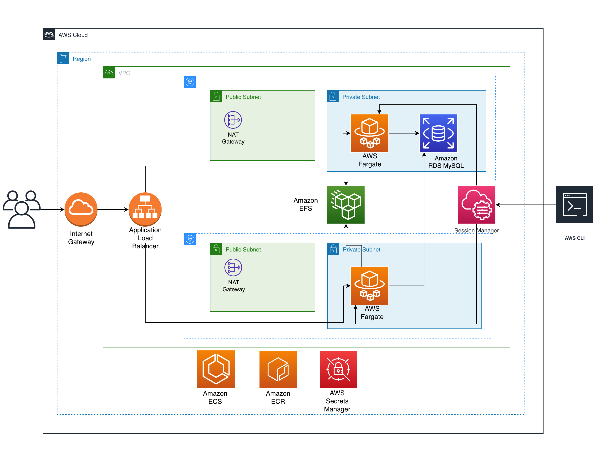

<!--- 
Copyright Amazon.com, Inc. or its affiliates. All Rights Reserved.
SPDX-License-Identifier: MIT-0  
--->

# Deploying Moodle with Containers in Amazon ECS using AWS CDK

WARNING! Deploying this projet will create AWS resources. Make sure you are aware of the costs and be sure to destory the stacks when you are done by running cdk destory

This package depends on and may incorporate or retrieve a number of third-party software packages (such as open source packages) at install-time or build-time or run-time ("External Dependencies"). The External Dependencies are subject to license terms that you must accept in order to use this package. If you do not accept all of the applicable license terms, you should not use this package. We recommend that you consult your company's open source approval policy before proceeding.

Provided below is a list of External Dependencies and the applicable license identification as indicated by the documentation associated with the External Dependencies as of Amazon's most recent review.

THIS INFORMATION IS PROVIDED FOR CONVENIENCE ONLY. AMAZON DOES NOT PROMISE THAT THE LIST OR THE APPLICABLE TERMS AND CONDITIONS ARE COMPLETE, ACCURATE, OR UP-TO-DATE, AND AMAZON WILL HAVE NO LIABILITY FOR ANY INACCURACIES. YOU SHOULD CONSULT THE DOWNLOAD SITES FOR THE EXTERNAL DEPENDENCIES FOR THE MOST COMPLETE AND UP-TO-DATE LICENSING INFORMATION.

YOUR USE OF THE EXTERNAL DEPENDENCIES IS AT YOUR SOLE RISK. IN NO EVENT WILL AMAZON BE LIABLE FOR ANY DAMAGES, INCLUDING WITHOUT LIMITATION ANY DIRECT, INDIRECT, CONSEQUENTIAL, SPECIAL, INCIDENTAL, OR PUNITIVE DAMAGES (INCLUDING FOR ANY LOSS OF GOODWILL, BUSINESS INTERRUPTION, LOST PROFITS OR DATA, OR COMPUTER FAILURE OR MALFUNCTION) ARISING FROM OR RELATING TO THE EXTERNAL DEPENDENCIES, HOWEVER CAUSED AND REGARDLESS OF THE THEORY OF LIABILITY, EVEN IF AMAZON HAS BEEN ADVISED OF THE POSSIBILITY OF SUCH DAMAGES. THESE LIMITATIONS AND DISCLAIMERS APPLY EXCEPT TO THE EXTENT PROHIBITED BY APPLICABLE LAW.

Moodle - https://docs.moodle.org/dev/License - GPLv3 or later

## Overview

This is a sample application using [Amazon Elastic Container Service](https://aws.amazon.com/ecs/), to deploy Moodle with Containers in Amazon ECS on Fargate using AWS CDK. The objective of this repository is to present a sample application written in Python using CDK.

## Architecture

<p align="center"> 

</p>

## Prerequisites

### Git
* Install [git](https://git-scm.com/book/en/v2/Getting-Started-Installing-Git)

### Docker
* Docker installed and running on the local host or laptop.

### Python 3.x
* Install [Python](https://www.python.org/downloads/)

### AWS
* An AWS account
* [AWS CLI](https://docs.aws.amazon.com/cli/latest/userguide/install-cliv2.html)
* AWS CLI [configured](https://docs.aws.amazon.com/cli/latest/userguide/cli-configure-quickstart.html#cli-configure-quickstart-config)
* [AWS CDK](https://docs.aws.amazon.com/cdk/latest/guide/getting_started.html)

### Clone Repo
```bash
git clone https://github.com/aws-samples/aws-ecs-cdk-moodle
```
### Create Python Virtual Environment
You need a [Python Virtual Environment](https://docs.python.org/3/library/venv.html) to work in to ensure that the relevant modules are available to the sample.  The command must be executed inside the *aws-ecs-cdk-moodle* folder.
```bash
cd aws-ecs-cdk-moodle
python3 -m venv .venv 
```
## How to Build

### Terminal
All deployment commands must be executed inside the *aws-ecs-cdk-moodle* folder, navigate there if you have not already done so.
```bash
cd aws-ecs-cdk-moodle
```
### Activate Python Virtual Environment
```bash
source .venv/bin/activate
```
The terminal prompt should be prepended with a **(.venv)** if you have activated the python virtual environment correctly.  You need to activate the virtual environment each time you start a new terminal session.

### Install Python modules
```bash 
pip3 install -r requirements.txt
```
### Review
Application is composed of different stacks each with a different purpose, you can review the code to get a general understaing, also you can update default Moodle credentials in Application stack (ApplicationStack.py) or leave it as it is for the sample.

### Deploy 
1. Deploy the project using the following command in the root of the aws-ecs-cdk-moodle folder substituting username and password as required(by default it will ask confirmation before deploying every stack, you can override this with the "--require-approval never" flag, use it with caution)
``` bash
cdk deploy MoodleVPCDEV MoodleLoadBalancerDEV MoodleFileSystemDEV MoodleDatabaseDEV MoodleApplicationDEV
```
2. Wait for the new services to provision (This takes ~30 mins, make sure to provide confirmation on all stacks)
3. Visit the load balancer HTTP URL output by CDK (MoodleApplicationDEV.MoodleLoadBalancerDNSName) and login to Moodle
Initial credentials for Moodle are specified in ApplicationStack.py
```
## Clean Up
1. When you are finished, you can delete all the stacks within the application with the following command (by default it will ask confirmation before removing every stack, you can override this with the "--require-approval never" flag, use it with caution)
``` bash
cdk destroy MoodleVPCDEV MoodleLoadBalancerDEV MoodleFileSystemDEV MoodleDatabaseDEV MoodleApplicationDEV 
```
## Contributing
See [CONTRIBUTING](CONTRIBUTING.md#security-issue-notifications) for more information.
## License

This library is licensed under the MIT-0 License. See the LICENSE file.


